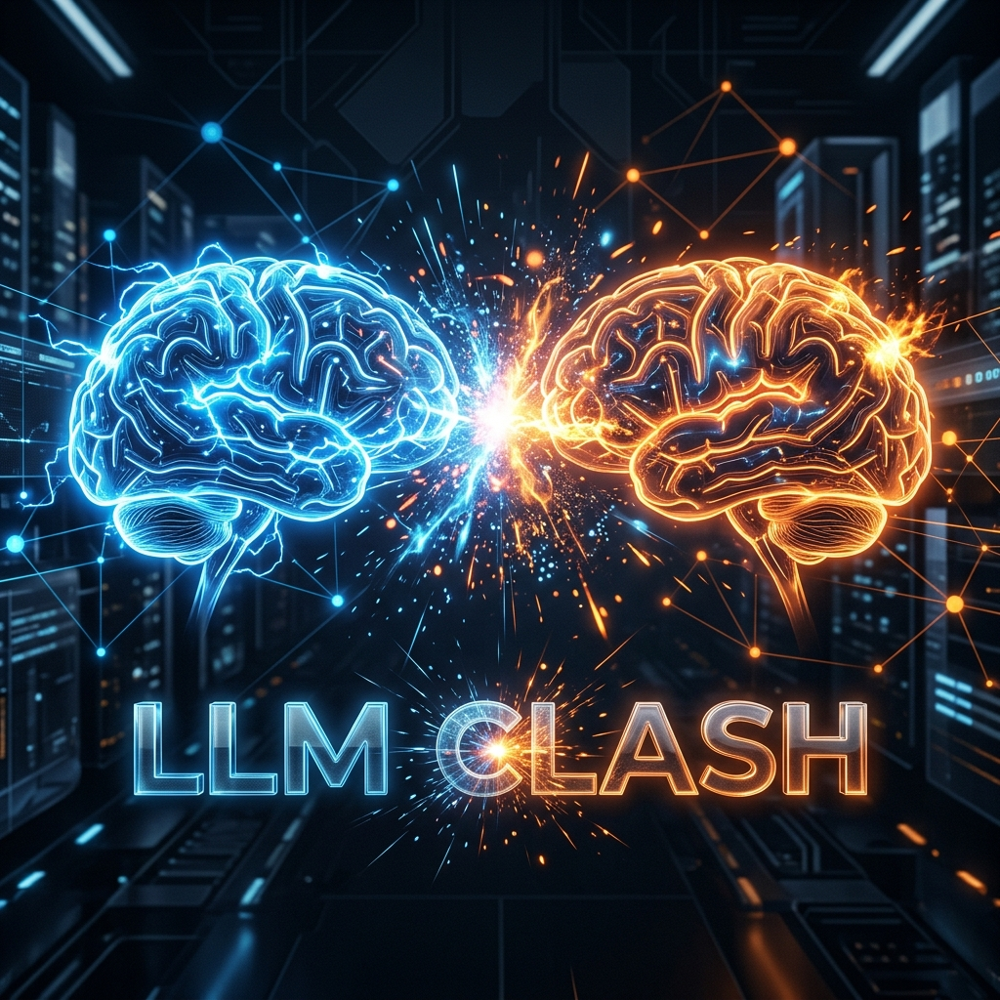
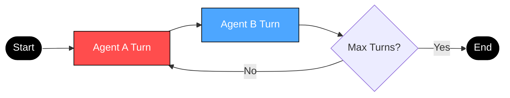

<div align="center">

# ⚔️ LLM CLASH ⚔️



<p align="center">
  
  
  
</p>

**High-speed LLM debate orchestration via Groq & Bun.**

---

[Features](#-features) • [Deployment](#-deployment) • [Architecture](#-architecture) • [Configuration](#-configuration)

</div>

---

## 📖 Introduction

**LLM Clash** pits two specialized AI agents against each other in a real-time, multi-turn debate. Engineered for extreme low latency, it showcases the power of the **Groq LPU Inference Engine** combined with the efficiency of the **Bun** runtime.

### 🎭 Agent Personas

| Role | Model | Personality | Approach |
| :--- | :--- | :--- | :--- |
| **Agent A** 🔴 | `Llama-3.3-70b` | **The Aggressor** | Assertive, high-pressure, logical dominance. |
| **Agent B** 🔵 | `GPT-OSS-20b` | **The Logician** | Calm, composed, analytical de-escalation. |

---

## 🚀 Deployment

### 1. Installation
```bash
bun install
```

### 2. Configuration
```bash
# Windows
$env:GROQ_API_KEY="your_api_key"

# Unix
export GROQ_API_KEY="your_api_key"
```

### 3. Execution
```bash
bun run index.ts
```

---

## 🛠️ Architecture



---

## 📦 Tech Stack

- **Runtime Engine** 🏃 `Bun`
- **Primary Language** 📘 `TypeScript`
- **Inference Engine** 🧠 `Groq SDK`
- **Models** 🤖 `Llama 3.3` & `GPT-OSS`

---

## ✨ Key Features

- 🏎️ **Instant Response**: Real-time streaming from Groq.
- 🛡️ **Type-Safe**: Developed entirely in TypeScript.
- 🎭 **Context-Aware**: Full conversation history management.
- 🔌 **Extensible**: Support for DeepSeek and more providers.

---

<div align="center">

### 🤝 Community
[Contribute](#-contributing) • [License](LICENSE)

**Developed with precision by Sanidhya Gupta**

</div>
