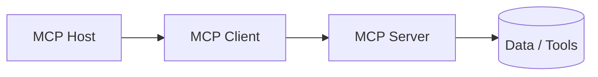

# Weather MCP Server 🌦️ & MCP Deep Dive

[](https://mcp.io)
[](https://bun.sh)

> "The USB-C for AI Applications." 

This repository is a hands-on implementation of a **Weather MCP Server** using TypeScript and Bun. It also serves as a comprehensive guide to understanding the **Model Context Protocol (MCP)**.

---

## 🧠 What is MCP? (The "Why")

Before MCP, if you wanted an AI (like Claude or ChatGPT) to talk to your local database, check your calendar, or fetch live weather, you had to write custom, complex integrations for every single app. 

### The Problem
1. **Knowledge Cutoff:** LLMs are trained on past data. They don't know what's happening *right now*.
2. **Data Silos:** Your data lives in Slack, Google Drive, GitHub, and local files. AI can't "see" them without specific permissions and connectors.
3. **Fragmentation:** Every AI company had its own way of connecting to tools.

### The Solution: MCP
The **Model Context Protocol (MCP)** is an open standard that allows developers to build a **single server** that can talk to **any AI model**. It standardizes how AI agents discover and use tools/data, regardless of which company built the AI.

---

## 🏗️ Core Architecture

The MCP ecosystem works through a simple three-tier relationship:



1.  **MCP Host:** The app you use (e.g., **Claude Desktop**, **Cursor IDE**, or a custom web app).
2.  **MCP Client:** The hidden layer inside the Host that manages the connection.
3.  **MCP Server:** A lightweight program (like this repo!) that exposes specific data or functions.
4.  **Local/Remote Data:** The actual source (Database, API, or local Filesystem).

---

## ⚡ The Three Pillars of MCP

An MCP server can offer three main types of functionality:

| Pillar | What it is | Example |
| :--- | :--- | :--- |
| **Resources** 📚 | **Data-centric.** Think of them like "Read-only files" or database records the AI can pull into its context. | A `logs.txt` file or a specific database table. |
| **Tools** 🛠️ | **Action-centric.** These are executable functions. The AI can decide to "call" them to do something. | **(This Project)** `getWeatherByCityName` or `delete_file`. |
| **Prompts** 📝 | **Workflow-centric.** Pre-written templates that guide the AI on how to handle specific tasks. | A "Security Audit" prompt template. |

---

## 📡 Transport Layers: How they Talk

Servers and Hosts need a way to send messages back and forth. MCP supports two main "Transports":

### 1. STDIO (Standard Input/Output)
- **Local only.** The server runs as a process on your machine.
- Messages are sent via the terminal streams (`stdin`/`stdout`).
- **Best for:** Local developer tools, private file access.

### 2. SSE (Server-Sent Events)
- **Remote.** The server runs on a cloud provider (AWS, Vercel, etc.).
- Communication happens over HTTP.
- **Best for:** SaaS integrations (Slack, GitHub, Weather APIs).

---

## 🔄 The MCP Workflow (The Lifecycle)

When you open Claude Desktop with this Weather Server enabled, this happens:

1.  **Discovery (List):** The Host asks the Server: *"What can you do?"* The server responds with a list of Tools (e.g., `getWeatherByCityName`).
2.  **User Request:** You type: *"What's the weather in Varanasi?"*
3.  **Reasoning:** Claude sees the request and thinks: *"I don't know the weather, but I have a tool called `getWeatherByCityName`. I'll use that."*
4.  **Invocation (Call):** The Client sends a request to the Server: `call tool: getWeatherByCityName { city: "Varanasi" }`.
5.  **Execution:** The Server runs the TypeScript code, fetches the data (30°C, Sunny), and sends it back.
6.  **Response:** Claude receives the data and tells you: *"It's a sunny day in Varanasi with a temperature of 30°C."*

---

## 🛠️ This Project's Implementation

This specific server is built with:
- **Bun:** For lightning-fast TypeScript execution.
- **Zod:** To define the "Input Schema" so the AI knows exactly what parameters to send (e.g., `city` must be a `string`).

### The Zod Bridge
MCP needs JSON Schema, but developers love Zod. We use this helper to bridge them:
```typescript
const withJsonSchema = <T extends z.ZodTypeAny>(schema: T) => {
    return {
        ...schema,
        "~standard": {
            ...schema["~standard"],
            jsonSchema: zodToJsonSchema(schema),
        },
    } as any;
};
```

---

## 🚀 How to Run & Integrate

### 1. Installation
```bash
bun install
```

### 2. Configuration (Claude Desktop)
Add this to your `claude_desktop_config.json`:

```json
{
  "mcpServers": {
    "weather": {
      "command": "bun",
      "args": ["run", "D:/4. GenAI/2. Advance-GenAI/5. MCP/index.ts"]
    }
  }
}
```

---

## 🤝 Community & Docs
- [Official MCP Documentation](https://modelcontextprotocol.io)
- [Official SDKs](https://github.com/modelcontextprotocol)

---
*Deep dive authored for the Advanced GenAI Workspace.*