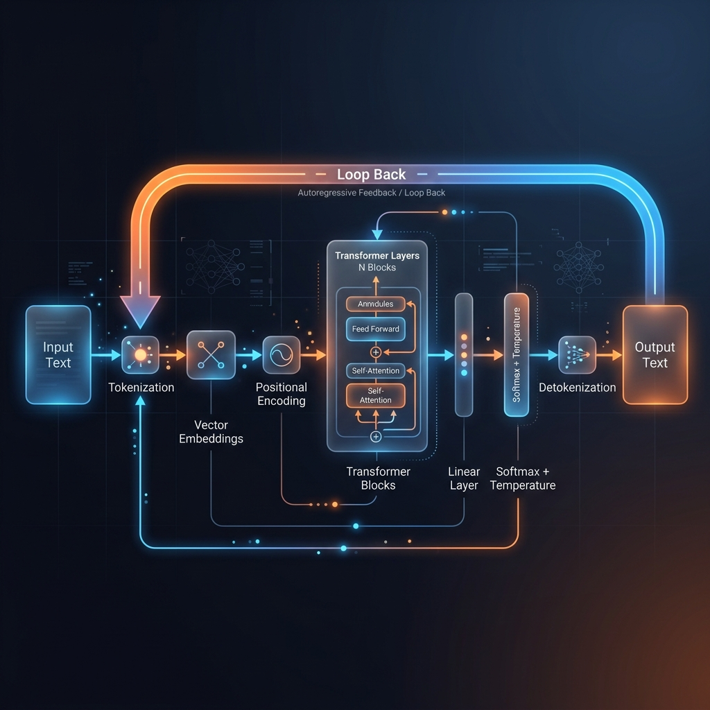
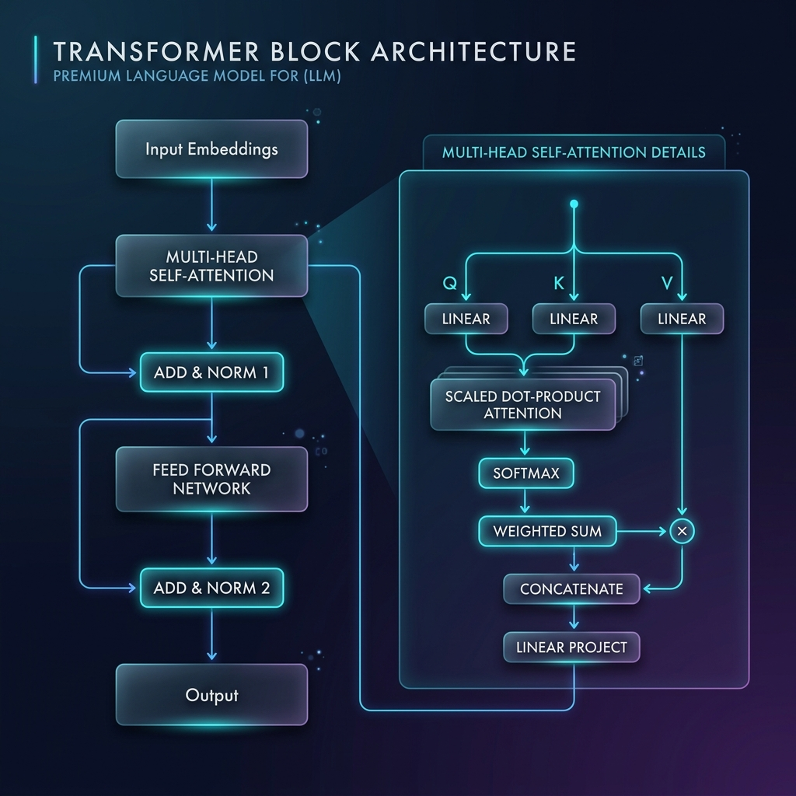
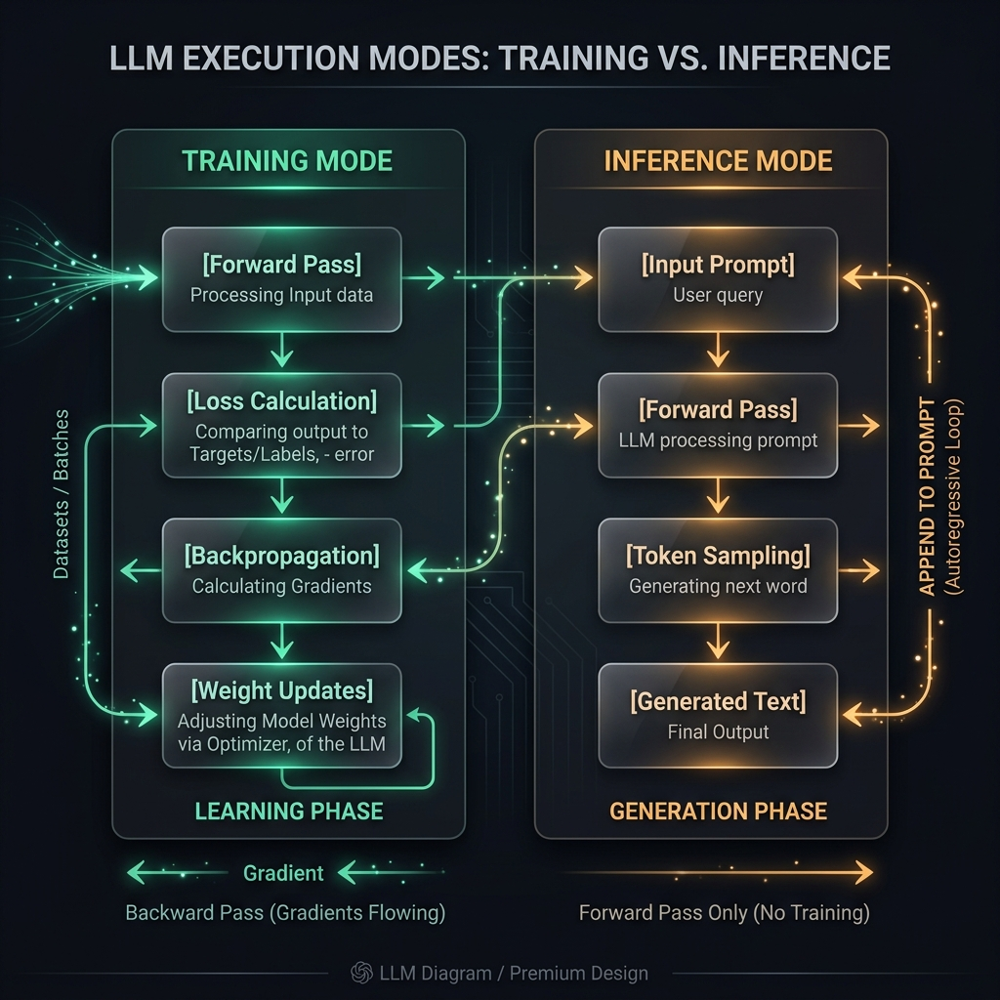

# 🤖 How LLMs Work: A Deep Dive into Large Language Models


This project provides a comprehensive overview of the inner workings of Large Language Models (LLMs). Rather than "artificial intelligence" in a biological sense, LLMs are complex systems built on science, mathematics, and high-performance code.

## 📋 Table of Contents
- [Overview](#overview)
- [The GPT Architecture](#the-gpt-architecture)
- [1. The Encoding Phase (Input Processing)](#1-the-encoding-phase-input-processing)
  - [Tokenization](#tokenization)
  - [Vector Embeddings](#vector-embeddings)
  - [Positional Encoding](#positional-encoding)
  - [Self-Attention & Multi-Head Attention](#self-attention--multi-head-attention)
- [2. The Generation Phase (Output Prediction)](#2-the-generation-phase-output-prediction)
  - [Linear Layer](#linear-layer)
  - [Softmax Layer (Temperature)](#softmax-layer-temperature)
  - [Detokenization](#detokenization)
  - [Auto-regressive Loop](#auto-regressive-loop)
- [3. Training vs. Inferencing](#3-training-vs-inferencing)
- [Visual Flow Diagrams](#visual-flow-diagrams)
- [Example Applications](#example-applications)
- [Contributing](#contributing)
- [License](#license)

## 🎯 Overview

Large Language Models (LLMs) like GPT are revolutionary AI systems that can understand and generate human-like text. They achieve this through a combination of sophisticated architecture, massive training data, and advanced mathematical operations.

> 💡 **Key Insight**: LLMs don't "understand" language like humans do. Instead, they learn statistical patterns in text data to predict the most probable next word given a sequence of words.

**What is GPT?** It stands for **Generative Pre-trained Transformer**:
- **Generative**: Unlike search engines that retrieve pre-existing web data, LLMs create new sequences of text on the spot.
- **Pre-trained**: The model is trained on vast datasets (books, internet, historical data) to learn patterns.
- **Transformer**: The core architecture (based on the 'Attention is All You Need' paper) that processes these inputs.

## 🏗️ The GPT Architecture

GPT stands for **Generative Pre-trained Transformer**, representing the three pillars of the model:

| Pillar | Description | Emoji |
|--------|-------------|-------|
| **Generative** | Unlike search engines that retrieve existing data, LLMs create new content by generating the next logical sequence based on input. | 🎨 |
| **Pre-trained** | Models undergo massive training on internet data, literature, and conversations to learn the patterns of human language. | 📚 |
| **Transformer** | The core neural network architecture (introduced by Google in 2017) that processes sequences in parallel and captures long-range dependencies. | ⚡ |

---

## 1️⃣ The Encoding Phase (Input Processing)

Computers cannot process language directly; they require mathematical representations.

### 🔤 Tokenization

Input text is split into smaller units called **tokens**. These are mapped to fixed numerical IDs using a vocabulary dictionary (e.g., "Hey" → `10`, "There" → `36`).

> 📝 **Fun Fact**: Common words like "the" get single tokens, while complex words like "uncharacteristically" might be split into multiple tokens.

### 🧮 Vector Embeddings

Tokens are mapped onto a multi-dimensional matrix (often 512 to 4096 dimensions in modern LLMs). This captures semantic relationships, allowing the model to "understand" that:
- "Cat" is mathematically closer to "Kitten" than to "Car"
- "King" - "Man" + "Woman" ≈ "Queen"

### 📍 Positional Encoding

Since tokenization doesn't inherently track sequence, positional encoding injects a matrix that defines word order. This allows the model to distinguish between:
- "The dog chased the cat" (different from)
- "The cat chased the dog"

### ⚡ Self-Attention & Multi-Head Attention

*   **Self-Attention**: Allows tokens to "communicate" to establish context. For example, if "bank" appears near "river," the model shifts the mathematical meaning away from "finance."
*   **Multi-Head Attention**: Enables the model to analyze multiple contextual relationships in parallel, significantly improving comprehension speed and accuracy.

---

## 2️⃣ The Generation Phase (Output Prediction)

Once the input is mathematically understood, the model begins the decoding process.

### 1. 📊 Linear Layer
Calculates a probability distribution for the next likely token (e.g., 80% chance for 'the', 15% for 'a', 5% for other words).

### 2. 🌡️ Softmax Layer (Temperature)
This function selects the final token. Adjusting the "Temperature" parameter controls creativity:
- **Low Temperature (0.1)**: More deterministic, focused outputs
- **High Temperature (1.0+)**: More creative, random outputs

### 3. 🔤 Detokenization
The chosen numerical token is converted back into human-readable text using the vocabulary dictionary.

### 4. 🔄 Auto-regressive Loop
The model functions as an advanced 'auto-complete' that iteratively predicts the next most probable token. This loop continues by appending the new output back into the model until an 'end of string' token is reached or maximum length is exceeded.

---

## 3️⃣ Training vs. Inferencing

LLMs operate in two distinct modes:

| Aspect | Training | Inferencing |
|--------|----------|-------------|
| **Purpose** | Learning phase where model adapts to data | Usage phase where model generates responses |
| **Process** | Forward pass → Loss calculation → Backpropagation | Forward pass only |
| **Parameters** | Weights are updated | Weights remain fixed |
| **Compute** | High (requires GPUs/TPUs) | Lower (but still significant) |
| **Key Mechanism** | Backpropagation: Adjusting internal weights to minimize "loss" | Forward Pass: Using existing weights without changing structure |

| Phase | Description | Key Mechanism |
|-------|-------------|---------------|
| **Training** | The learning stage where the model is fed data to predict outcomes. Errors are measured against known answers (labels). | **Backpropagation:** Adjusting internal weights to minimize "loss." |
| **Inferencing** | The active usage stage (e.g., chatting with ChatGPT). The model applies its training to generate responses. | **Forward Pass:** Using existing weights without changing the model's structure. |

---

## 📊 Visual Flow Diagrams

### LLM Processing Pipeline



### Transformer Block Internal Structure



### Training vs Inference Flow



---

## 🖼️ Example Applications & Use Cases

While this repository focuses on conceptual understanding, LLMs power numerous real-world applications:

| Application | Description | Example Models |
|-------------|-------------|----------------|
| 💬 **Chatbots** | Conversational AI assistants | GPT-4, Claude, Llama 2 |
| 📝 **Content Creation** | Writing articles, stories, marketing copy | Jasper, Copy.ai |
| 🌐 **Translation** | Real-time language translation | Google Translate, DeepL |
| 💻 **Code Generation** | Writing and debugging code | GitHub Copilot, AlphaCode |
| 📊 **Data Analysis** | Extracting insights from text data | Various domain-specific LLMs |
| 🔍 **Information Retrieval** | Question answering over documents | Perplexity AI, You.com |


---

## 🛠️ Technical Implementation Details

For those interested in the mathematical foundations:

### Attention Mechanism Formula
```
Attention(Q, K, V) = softmax(QK^T / √d_k)V
```
Where:
- Q = Query matrix
- K = Key matrix  
- V = Value matrix
- d_k = dimension of key vectors

### Positional Encoding
```
PE_(pos,2i)   = sin(pos/10000^(2i/d_model))
PE_(pos,2i+1) = cos(pos/10000^(2i/d_model))
```

### Loss Function (Training)
Cross-entropy loss between predicted distribution and actual next token.

---

## 🤝 Contributing

If you would like to contribute more technical details, research papers, diagrams, or code examples to this documentation, please feel free to open a Pull Request.

### How to Contribute
1. Fork the repository
2. Create a new branch (`git checkout -b feature/amazing-content`)
3. Make your changes
4. Commit your changes (`git commit -am 'Add amazing content'`)
5. Push to the branch (`git push origin feature/amazing-content`)
6. Create a new Pull Request

Please ensure your contributions align with the project's goal of providing clear, accurate explanations of LLM internals.

## 📜 License

This project is licensed under the MIT License - see the [LICENSE](LICENSE) file for details.

---

## ⚠️ Limitations and Considerations

While LLMs are powerful, they have important limitations to understand:

| Limitation | Description | Mitigation Strategies |
|------------|-------------|----------------------|
| **Hallucinations** | Models may generate plausible-sounding but factually incorrect information | Fact-checking, retrieval augmentation, confidence scoring |
| **Bias** | Models can inherit and amplify biases present in training data | Careful data curation, bias detection tools, inclusive training |
| **Lack of True Understanding** | LLMs pattern-match rather than comprehend like humans | Combine with symbolic AI, use for augmentation not replacement |
| **Context Limits** | Fixed context window restricts processing of very long documents | Sliding window approaches, hierarchical models, external memory |
| **Compute Intensive** | Training and inference require significant computational resources | Model distillation, quantization, efficient architectures |
| **Data Privacy** | Training on public data may inadvertently memorize sensitive information | Differential privacy, data filtering, auditing |

## 📚 Further Resources

For those wishing to dive deeper into LLM technology:

### 📖 Foundational Papers
- [Attention is All You Need (Vaswani et al., 2017)](https://arxiv.org/abs/1706.03762) - The Transformer architecture
- [Improving Language Understanding by Generative Pre-Training (Radford et al., 2018)] - Original GPT paper
- [Language Models are Few-Shot Learners (Brown et al., 2020)] - GPT-3 paper
- [Training Language Models to Follow Instructions with Human Feedback (Ouyang et al., 2022)] - InstructGPT/ChatGPT

### 🔧 Practical Libraries & Tools
- [Hugging Face Transformers](https://huggingface.co/docs/transformers/index) - State-of-the-art NLP library
- [TensorFlow](https://www.tensorflow.org/) & [PyTorch](https://pytorch.org/) - Deep learning frameworks
- [LangChain](https://www.langchain.com/) - Framework for LLM-powered applications
- [LlamaIndex](https://www.llamaindex.ai/) - Data framework for LLM applications

### 🎓 Courses & Tutorials
- [CS224N: Natural Language Processing with Deep Learning](https://web.stanford.edu/class/cs224n/) (Stanford)
- [Deep Learning Specialization](https://www.coursera.org/specializations/deep-learning) (Andrew Ng)
- [Hugging Face NLP Course](https://huggingface.co/learn/nlp-course)
- [LLM University](https://learn.deeplearning.ai/llm-course/) (DeepLearning.AI)

### 💡 Community & Discussion
- [r/MachineLearning](https://www.reddit.com/r/MachineLearning/) (Reddit)
- [r/LocalLLaMA](https://www.reddit.com/r/LocalLLaMA/) (Reddit)
- [Hugging Face Forums](https://discuss.huggingface.co/)
- [Paper with Codes](https://paperswithcode.com/) - Latest implementations

## 🙏 Acknowledgments

- The original Transformer paper: "Attention is All You Need" (Vaswani et al., 2017)
- GPT series papers from OpenAI
- Hugging Face Transformers library for practical implementations
- The open-source AI community for continuous advancements

---

*Last updated: May 2026*