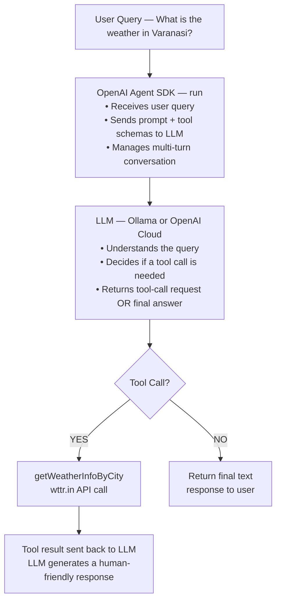

# 🤖 OpenAI Agent SDK with Ollama (Local LLM)

An AI-powered agent built with the **OpenAI Agent SDK** that runs entirely on your local machine using **Ollama**. The agent supports **tool/function calling** — demonstrated here with a real-time weather lookup tool — and can be easily extended with additional tools.

---

## 📐 Architecture / How It Works



### Step-by-Step Flow

1. **User submits a query** → e.g., _"What's the weather in Varanasi?"_
2. **Agent SDK** wraps the query with the agent's system instructions and available tool definitions, then sends it to the LLM.
3. **LLM processes** the prompt and decides whether it needs to call a tool.
4. **If a tool call is needed**, the SDK executes the matching tool function locally (e.g., fetches weather from `wttr.in`).
5. **Tool result is returned** to the LLM, which then produces a final, human-readable response.
6. **`run()` returns** the agent's final output to the caller.

---

## 🛠️ Tech Stack

| Layer            | Technology                                                                 |
| ---------------- | -------------------------------------------------------------------------- |
| **Runtime**      | [Bun](https://bun.sh) — Fast all-in-one JavaScript/TypeScript runtime     |
| **Language**     | TypeScript                                                                 |
| **Agent Framework** | [`@openai/agents`](https://www.npmjs.com/package/@openai/agents) (v0.11+) — OpenAI Agent SDK |
| **LLM Client**  | [`openai`](https://www.npmjs.com/package/openai) (v6+) — Official OpenAI Node SDK |
| **Local LLM**   | [Ollama](https://ollama.com) — Run LLMs locally (llama3.2, mistral, etc.) |
| **Schema Validation** | [`zod`](https://zod.dev) (v4+) — Tool parameter validation             |
| **HTTP Client**  | [`axios`](https://axios-http.com) — Weather API requests                  |
| **Weather API**  | [wttr.in](https://wttr.in) — Free, no-auth weather service                |

---

## 📋 Prerequisites

- **[Bun](https://bun.sh)** (v1.3+) — Install with:
  ```bash
  # Windows (PowerShell)
  powershell -c "irm bun.sh/install.ps1 | iex"

  # macOS / Linux
  curl -fsSL https://bun.sh/install | bash
  ```

- **[Ollama](https://ollama.com)** (for local setup) — Download and install from [ollama.com](https://ollama.com/download)

---

## 🚀 Setup & Run

### Option 1: Local with Ollama (Default)

This is the default configuration. The agent connects to a locally running Ollama instance.

**1. Install and start Ollama**

```bash
# Download from https://ollama.com/download and install

# Pull the required model
ollama pull llama3.2

# Verify Ollama is running (it starts automatically after install)
ollama list
```

**2. Clone & install dependencies**

```bash
git clone <your-repo-url>
cd OpenAI-Agent-SDK
bun install
```

**3. Run the agent**

```bash
bun run index.ts
```

**Expected output (single city):**

```
Starting agent...
Getting weather for Varansi...
Weather response received: varansi: ☀️  +31°C
Agent Response: Based on the tool call response, it appears that Varanasi
is currently experiencing warm weather with a high of 31°C (88°F)...
```

**Expected output (multiple cities):**

```
Starting agent...
Getting weather for ['Varansi', 'Gujrat', 'Surat']...
Weather response received: [ varansi , gujrat , surat ]: ☀️  +30°C
Agent Response: The current weather for the cities you requested is as follows:
- Varansi: It's currently around 30 degrees Celsius with sunny conditions.
- Gujrat: Same temperature of 30°C with clear sky and no precipitation forecasted.
- Surat: Same temperature of 30 degrees Celsius, mostly sunny.

Please note that these are simulated weather updates. For real-time updates,
consider searching for official sources like Accuweather or the National
Weather Service (NWS) for the most accurate information.
```

---

### Option 2: Cloud with OpenAI API

To use OpenAI's cloud models (e.g., `gpt-4o`, `gpt-4o-mini`) instead of local Ollama, make the following changes in `index.ts`:

**1. Set your API key as an environment variable**

```bash
# Windows (PowerShell)
$env:OPENAI_API_KEY = "sk-your-api-key-here"

# macOS / Linux
export OPENAI_API_KEY="sk-your-api-key-here"
```

**2. Update `index.ts`**

Replace the Ollama client and model configuration:

```diff
- // 1. Initialize OpenAI client to point to your local Ollama instance
- const ollamaClient = new OpenAI({
-     baseURL: 'http://localhost:11434/v1/',
-     apiKey: 'ollama',
-     dangerouslyAllowBrowser: true
- });
-
- // 2. Configure the model wrapper with the custom client
- const ollamaModel = new OpenAIChatCompletionsModel(
-     ollamaClient,
-     'llama3.2:latest'
- );
+ // 1. Initialize OpenAI client (uses OPENAI_API_KEY env var automatically)
+ const openaiClient = new OpenAI();
+
+ // 2. Configure the model wrapper with cloud model
+ const cloudModel = new OpenAIChatCompletionsModel(
+     openaiClient,
+     'gpt-4o-mini'   // or 'gpt-4o', 'gpt-3.5-turbo', etc.
+ );
```

Then update the agent to use the new model:

```diff
  const All_Rounder_Agent = new Agent({
-     model: ollamaModel,
+     model: cloudModel,
      name: 'All-Rounder',
      ...
  });
```

**3. Run the agent**

```bash
bun run index.ts
```

---

## 🧩 Project Structure

```
OpenAI-Agent-SDK/
├── index.ts          # Main entry — agent definition, tool, and runner
├── package.json      # Dependencies and project metadata
├── tsconfig.json     # TypeScript compiler options (strict, ESNext)
├── bun.lock          # Bun lockfile
├── .gitignore        # Git ignore rules
└── README.md         # This file
```

---

## 🔧 Adding Custom Tools

You can extend the agent by adding new tools. Each tool needs a **name**, **description**, **Zod schema** for parameters, and an **execute** function:

```typescript
import { tool } from '@openai/agents';
import { z } from 'zod';

const myCustomTool = tool({
    name: 'myCustomTool',
    description: 'Describe what this tool does',
    parameters: z.object({
        param1: z.string().describe('Description of param1'),
        param2: z.number().optional().describe('Optional numeric param'),
    }),
    execute: async ({ param1, param2 }) => {
        // Your tool logic here
        return `Result for ${param1}`;
    }
});

// Add it to the agent's tools array
const agent = new Agent({
    model: ollamaModel,
    name: 'My Agent',
    instructions: '...',
    tools: [getWeatherInfoByCity, myCustomTool]  // ← add here
});
```

---

## 🔑 Key Concepts

| Concept              | Description                                                                                                  |
| -------------------- | ------------------------------------------------------------------------------------------------------------ |
| **Agent**            | An LLM wrapper with a name, instructions (system prompt), and a set of tools it can use                      |
| **Tool**             | A function the LLM can decide to call. Defined with a Zod schema so the LLM knows the expected parameters   |
| **`run()`**          | Executes the agent loop — sends query → LLM responds or calls tools → loop until final answer (or maxTurns) |
| **`maxTurns`**       | Safety limit on the number of LLM ↔ tool round-trips to prevent infinite loops                               |
| **OpenAI-compatible API** | Ollama exposes an OpenAI-compatible API at `localhost:11434/v1/`, letting the SDK work seamlessly        |

---

## 📝 Notes

- **Tracing** is disabled (`setTracingDisabled(true)`) to suppress SDK warning logs in the terminal.
- **Ollama's API key** is set to `'ollama'` — the SDK requires an `apiKey` field, but Ollama ignores it.
- The weather tool uses the free [wttr.in](https://wttr.in) API which requires **no authentication**.
- **Tool calling quality** depends on the model — `llama3.2` supports tool calling well; smaller models may not.

---

## 📄 License

This project is for **educational / learning purposes**.
