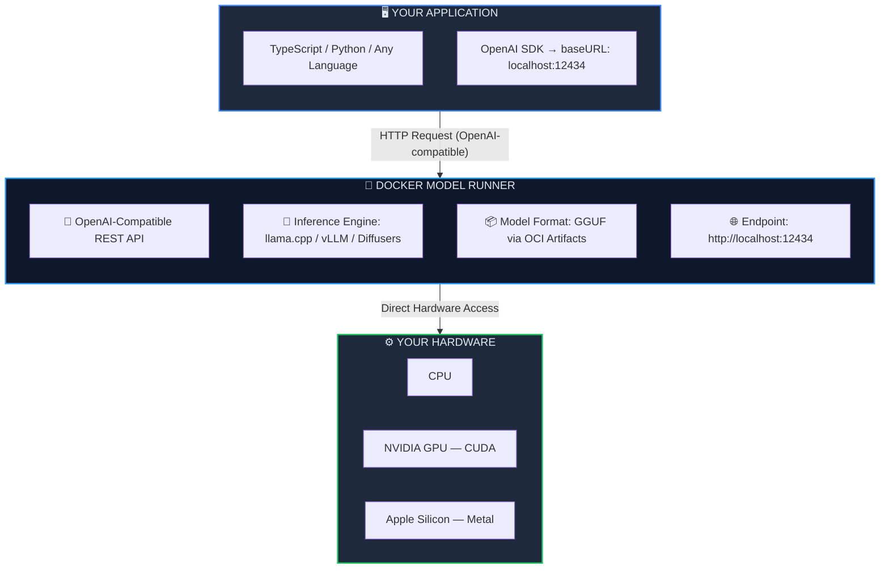
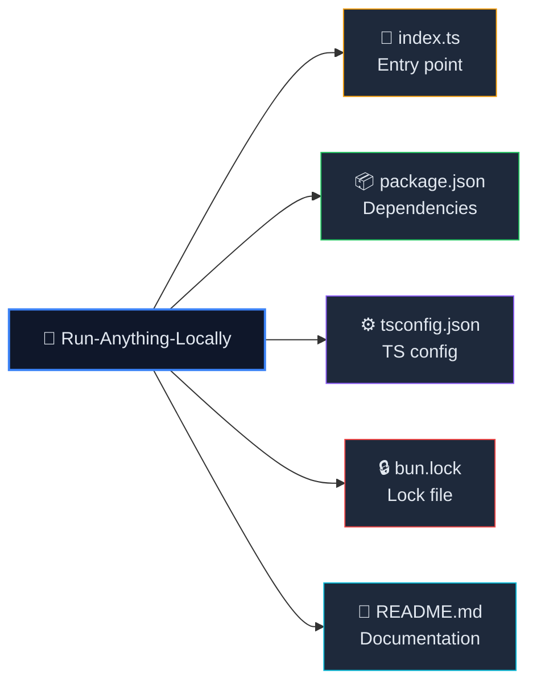

<p align="center">
  
  
  
  
</p>

<h1 align="center">🚀 Run Anything Locally</h1>

<p align="center">
  <strong>Run powerful AI models on your own machine — zero cloud, zero API keys, full privacy.</strong><br/>
  Powered by <a href="https://docs.docker.com/desktop/features/model-runner/">Docker Model Runner (DMR)</a> &amp; the OpenAI-compatible local API.
</p>

<p align="center">
  <a href="#-quick-start">Quick Start</a> •
  <a href="#-what-is-docker-model-runner-dmr">What is DMR?</a> •
  <a href="#-available-models">Models</a> •
  <a href="#%EF%B8%8F-architecture">Architecture</a> •
  <a href="#-advanced-usage">Advanced</a>
</p>

---

## 📖 Overview

This project demonstrates how to run **any AI/LLM model entirely on your local machine** using **Docker Model Runner (DMR)** — no cloud services, no paid API keys, no data leaving your computer. It uses the OpenAI SDK to communicate with a local model via DMR's OpenAI-compatible REST API.

### ✨ Key Highlights

| Feature | Description |
|---------|-------------|
| 🔒 **100% Private** | Your prompts and data never leave your machine |
| 💰 **Zero Cost** | No API keys or subscriptions required |
| ⚡ **Blazing Fast** | Direct hardware inference via `llama.cpp` engine |
| 🔌 **Drop-in Compatible** | Uses the standard OpenAI SDK — swap to cloud with one line |
| 🐳 **Docker Native** | Models managed like containers — pull, run, compose |

---

## 🧠 What is Docker Model Runner (DMR)?

**Docker Model Runner (DMR)** is a feature built directly into **Docker Desktop (v4.40+)** that lets you pull, run, and manage AI models locally — just like you manage Docker containers.

### How DMR Works



### DMR vs Other Local AI Tools

| Feature | Docker Model Runner | Ollama | LM Studio |
|---------|:------------------:|:------:|:---------:|
| Docker-native integration | ✅ | ❌ | ❌ |
| Docker Compose support | ✅ | ❌ | ❌ |
| OpenAI-compatible API | ✅ | ✅ | ✅ |
| OCI artifact distribution | ✅ | ❌ | ❌ |
| Built into Docker Desktop | ✅ | ❌ | ❌ |
| GPU acceleration | ✅ | ✅ | ✅ |
| GUI chat interface | ✅ | ❌ | ✅ |
| CLI management | ✅ | ✅ | ❌ |

---

## 🎯 Available Models

DMR supports a growing catalog of models from Docker Hub's `ai/` namespace and any GGUF model from Hugging Face.

### 🏷️ Popular Models

| Category | Model | Pull Command |
|----------|-------|--------------|
| 🗣️ **General LLM** | Gemma 3 | `docker model pull ai/gemma3` |
| 🗣️ **General LLM** | Llama 3.2 | `docker model pull ai/llama3.2` |
| 🗣️ **General LLM** | Qwen 3 | `docker model pull ai/qwen3` |
| 🗣️ **General LLM** | Mistral | `docker model pull ai/mistral` |
| 🗣️ **General LLM** | Phi-4 | `docker model pull ai/phi4` |
| 💻 **Coding** | Qwen 2.5 Coder | `docker model pull ai/qwen2.5-coder` |
| 💻 **Coding** | Qwen 3 Coder | `docker model pull ai/qwen3-coder` |
| 🧮 **Reasoning** | DeepSeek R1 Distill | `docker model pull ai/deepseek-r1-distill-llama` |
| 🧮 **Reasoning** | QwQ | `docker model pull ai/qwq` |
| 📐 **Embedding** | All-MiniLM | `docker model pull ai/all-minilm` |
| 📐 **Embedding** | Nomic Embed | `docker model pull ai/nomic-embed-text-v1.5` |
| 🖼️ **Image Gen** | Stable Diffusion | `docker model pull ai/stable-diffusion` |
| 🤏 **Tiny/Edge** | SmolLM 2 | `docker model pull ai/smollm2` |

> 💡 **This project uses:** `aistaging/gemma3:270M-UD-Q4_K_XL` — a ultra-lightweight quantized Gemma 3 variant perfect for quick local testing.

### 🔍 Search for More Models

```bash
docker model search                    # Browse all available models
docker model search gemma              # Search by keyword
```

---

## 🏗️ Architecture



### Core Code Walkthrough

The entire project is a single, elegant TypeScript file:

```typescript
import { OpenAI } from 'openai';

// 🔌 Connect to Docker Model Runner's local API
const client = new OpenAI({
    apiKey: "ollama",                                    // Any string works — no real key needed
    baseURL: "http://localhost:12434/engines/v1"         // DMR's OpenAI-compatible endpoint
});

// 🚀 Send a prompt and get a response
async function run(query: string) {
    console.log(query);
    const response = await client.chat.completions.create({
        model: "aistaging/gemma3:270M-UD-Q4_K_XL",     // Model running on DMR
        messages: [
            { role: "user", content: query }
        ]
    });
    console.log(response.choices?.[0]?.message.content);
}

run("Who developed Rust?");
```

> **Key insight:** The `apiKey` can be any string — DMR doesn't require authentication since everything runs locally. The `baseURL` points to DMR's API at port `12434`.

---

## ⚡ Quick Start

### Prerequisites

| Requirement | Minimum Version | Purpose |
|-------------|:--------------:|---------|
| [Docker Desktop](https://www.docker.com/products/docker-desktop/) | v4.40+ | Hosts Docker Model Runner |
| [Bun](https://bun.sh) | v1.3+ | JavaScript/TypeScript runtime |
| [Node.js](https://nodejs.org) *(alternative)* | v18+ | If not using Bun |

### Step 1 — Enable Docker Model Runner

1. Open **Docker Desktop**
2. Go to **Settings** → **AI**
3. Toggle **☑️ Enable Docker Model Runner**
4. *(Optional)* Enable **GPU-backed inference** for faster responses

### Step 2 — Pull a Model

```bash
# Pull the model used in this project
docker model pull aistaging/gemma3:270M-UD-Q4_K_XL

# Or try a larger, more capable model
docker model pull ai/gemma3
docker model pull ai/llama3.2
```

### Step 3 — Install Dependencies & Run

```bash
# Clone the repo
git clone https://github.com/SanidhyaGupta-10/GenAI---Artificial-intelligence.git
cd "11. Run-Anything-Locally"

# Install dependencies
bun install

# Run the project
bun run index.ts
```

### Expected Output

```
Who developed Rust?
Rust was developed by Graydon Hoare at Mozilla Research,
with contributions from the open-source community.
```

---

## 🔧 Advanced Usage

### Switch Models on the Fly

Change the `model` parameter in `index.ts` to use any pulled model:

```typescript
// Use Llama 3.2
model: "ai/llama3.2"

// Use Qwen 3
model: "ai/qwen3"

// Use a coding model
model: "ai/qwen2.5-coder"
```

### Use with Docker Compose

Create a `docker-compose.yml` to orchestrate your app alongside model management:

```yaml
services:
  app:
    build: .
    depends_on:
      - model-runner
    environment:
      - MODEL_API_URL=http://model-runner:12434/engines/v1

  model-runner:
    provider:
      type: model
      options:
        model: ai/gemma3
```

### Multi-Turn Conversations

Extend the code for context-aware conversations:

```typescript
const messages: OpenAI.ChatCompletionMessageParam[] = [];

async function chat(userMessage: string) {
    messages.push({ role: "user", content: userMessage });

    const response = await client.chat.completions.create({
        model: "aistaging/gemma3:270M-UD-Q4_K_XL",
        messages: messages
    });

    const reply = response.choices?.[0]?.message.content ?? "";
    messages.push({ role: "assistant", content: reply });
    console.log(`🤖 ${reply}`);
}

await chat("What is Rust?");
await chat("Who created it?");   // Remembers context!
```

### Streaming Responses

Get real-time token-by-token output:

```typescript
const stream = await client.chat.completions.create({
    model: "aistaging/gemma3:270M-UD-Q4_K_XL",
    messages: [{ role: "user", content: "Explain quantum computing" }],
    stream: true
});

for await (const chunk of stream) {
    process.stdout.write(chunk.choices?.[0]?.delta?.content ?? "");
}
```

---

## 🐳 Docker Deployment

### Dockerfile

```dockerfile
FROM oven/bun:1.3-alpine

WORKDIR /app

# Copy dependency files
COPY package.json bun.lock ./

# Install dependencies
RUN bun install --frozen-lockfile --production

# Copy source
COPY index.ts tsconfig.json ./

# Run the application
CMD ["bun", "run", "index.ts"]
```

### Build & Run

```bash
# Build the image
docker build -t run-anything-locally .

# Run (connect to host's DMR instance)
docker run --rm --network host run-anything-locally
```

> **Note:** `--network host` allows the container to access DMR running on `localhost:12434`.

---

## 🛠️ Troubleshooting

<details>
<summary><strong>❌ 404 Not Found Error</strong></summary>

```
error: 404 not found
```

**Cause:** The model hasn't been pulled yet or the model name is incorrect.

**Fix:**
```bash
# List available models
docker model list

# Pull the correct model
docker model pull aistaging/gemma3:270M-UD-Q4_K_XL
```
</details>

<details>
<summary><strong>❌ Connection Refused</strong></summary>

```
ECONNREFUSED 127.0.0.1:12434
```

**Cause:** Docker Model Runner is not enabled or Docker Desktop isn't running.

**Fix:**
1. Start Docker Desktop
2. Go to **Settings → AI → Enable Docker Model Runner**
3. Restart Docker Desktop
</details>

<details>
<summary><strong>❌ Slow Responses</strong></summary>

**Cause:** Running on CPU only.

**Fix:**
1. In Docker Desktop: **Settings → AI → Enable GPU-backed inference**
2. Ensure GPU drivers are up to date (NVIDIA CUDA / Apple Metal)
3. Consider using a smaller quantized model variant
</details>

---

## 📚 Resources

| Resource | Link |
|----------|------|
| Docker Model Runner Docs | [docs.docker.com/desktop/features/model-runner](https://docs.docker.com/desktop/features/model-runner/) |
| Docker Hub AI Models | [hub.docker.com/u/ai](https://hub.docker.com/u/ai) |
| OpenAI SDK (Node.js) | [github.com/openai/openai-node](https://github.com/openai/openai-node) |
| Bun Runtime | [bun.sh](https://bun.sh) |
| GGUF Model Format | [huggingface.co/docs/hub/gguf](https://huggingface.co/docs/hub/gguf) |

---

## 📜 License

This project is part of the [GenAI — Artificial Intelligence](https://github.com/SanidhyaGupta-10/GenAI---Artificial-intelligence) learning series.

---

<p align="center">
  <sub>Built with ❤️ using Docker Model Runner &amp; Bun</sub><br/>
  <sub>Run AI locally. Own your data. No limits.</sub>
</p>
