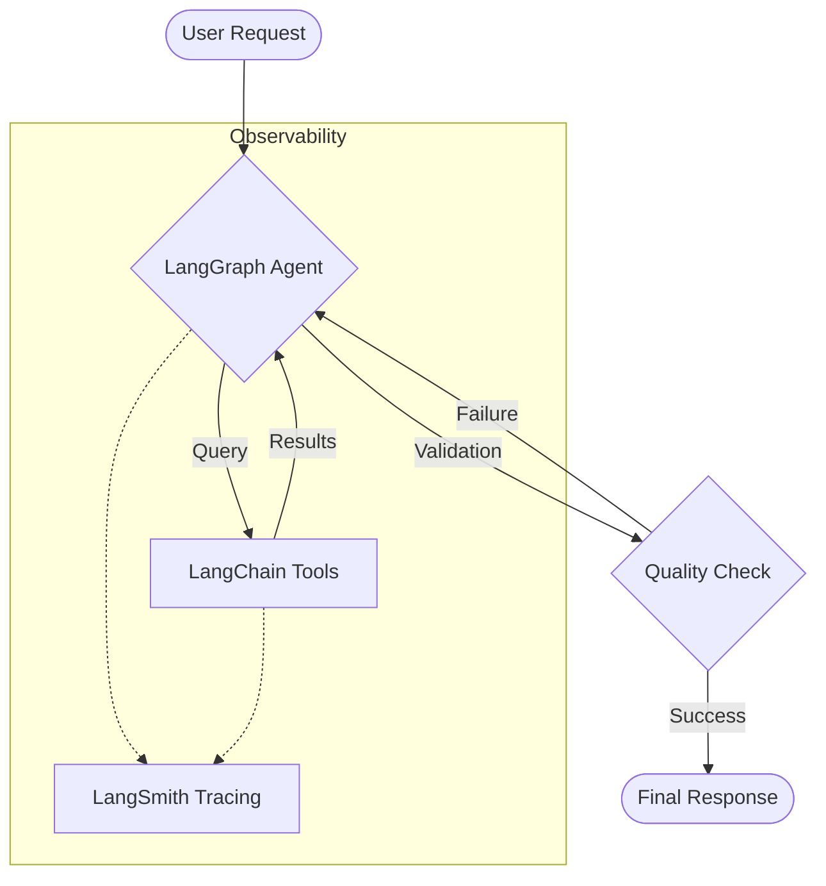

# 🧠 LLM Development Stack: LangChain, LangGraph & LangSmith


> **10-Word Summary: LangChain Builds, LangGraph Thinks, LangSmith Watches. The Complete AI Stack.**

Comprehensive guide and implementation overview for the modern AI development ecosystem using **TypeScript**. This repository focuses on the synergy between component building, stateful orchestration, and production-grade observability.

> **The Modular Trinity:** LangChain builds the components → LangGraph orchestrates the reasoning → LangSmith ensures reliability.

---

## 📑 Table of Contents
1. [Quick Overview](#-quick-overview)
2. [The Core Frameworks](#-the-core-frameworks)
3. [Architecture Visualization](#-architecture-visualization)
4. [Technical Implementation](#-technical-implementation)
5. [Best Practices & Pitfalls](#-best-practices--pitfalls)
6. [Get Started](#-get-started)

---

## 🎯 Quick Overview

| Tool | Focus | Logic Flow | Analogy |
| :--- | :--- | :--- | :--- |
| **LangChain.js** | Scaffolding | **Linear** (DAG) | Lego Bricks / Pipeline |
| **LangGraph.js** | Orchestration | **Cyclical** (Stateful) | Brain / Finite State Machine |
| **LangSmith** | Evaluation | **Tracing** (Observability) | Black Box Recorder / CCTV |

---

## 🧱 LangChain.js — The Foundation
**Workflow:** `Input → Retrieval → Augmentation → Generation`

LangChain.js is the industry-standard toolkit for building LLM applications in JavaScript/TypeScript environments. It provides the "atoms" of your application: Prompt templates, LLM wrappers, and Vector Store integrations.

*   **Key Paradigm:** **LCEL** (LangChain Expression Language).
*   **Best For:** RAG pipelines, simple chains, and data preprocessing.
*   **Modern Syntax:**
    ```typescript
    const chain = prompt.pipe(model).pipe(outputParser);
    const response = await chain.invoke({ input: "query" });
    ```

## 🕸️ LangGraph.js — The Agentic Brain
**Workflow:** `Input → Node → Edge → Decision → Loop → Result`

LangGraph.js extends LangChain to support **stateful, cyclical workflows**. Unlike standard chains, it allows agents to "think" in loops, enabling self-correction, multi-step planning, and multi-agent collaboration.

*   **Key Paradigm:** **State Machines (Annotations)**.
*   **Best For:** Research agents, coding assistants, and complex decision-making logic.
*   **Core Concepts:** Nodes (Work), Edges (Paths), and State (Shared Memory).

## 🛠️ LangSmith — The Control Tower
**Workflow:** `Trace → Debug → Evaluate → Optimize`

LangSmith is the observability layer. It records every interaction, token cost, and latency metric, allowing you to move from a "vibes-based" evaluation to hard metrics and automated unit tests for your LLM.

---

## 📋 Architecture Visualization

### 🔄 The Feedback Loop


---

## 🚀 Technical Implementation

### Modern Agentic Snippet (TypeScript 2025/2026)
This example demonstrates a stateful agent with built-in tracing and automatic message management.

```typescript
import { Annotation, StateGraph, START, END } from "@langchain/langgraph";
import { BaseMessage } from "@langchain/core/messages";
import { ChatOpenAI } from "@langchain/openai";

// 1. Define State using Annotations
const AgentState = Annotation.Root({
  messages: Annotation<BaseMessage[]>({
    reducer: (x, y) => x.concat(y), // Automates message history
    default: () => [],
  }),
});

// 2. Define Node Logic
const assistantNode = async (state: typeof AgentState.State) => {
  const model = new ChatOpenAI({ modelName: "gpt-4o" });
  const response = await model.invoke(state.messages);
  return { messages: [response] };
};

// 3. Assemble the Graph
const workflow = new StateGraph(AgentState)
  .addNode("assistant", assistantNode)
  .addEdge(START, "assistant")
  .addEdge("assistant", END);

// 4. Compile and Execute
const graph = workflow.compile();
const result = await graph.invoke({
  messages: [{ role: "user", content: "Hello, agent!" }],
});
```

---

## ❌ Common Pitfalls

| Mistake | Correction |
| :--- | :--- |
| **Over-Graphing** | Don't use LangGraph for linear flows. LangChain `.pipe()` is faster and simpler for basic RAG. |
| **State Mutability** | Always return a new state object from nodes. Do not modify the existing `state` in place. |
| **Vibes-based Eval** | Skipping LangSmith leads to "silent failures" in production. Always trace and eval. |
| **Complex Annotation** | Keep your state schema minimal. Only store what you need for the next step. |

---

## 💡 Real-World Example: Self-Correcting Research
1.  **User Task:** "Find the latest stats on GPU production."
2.  **LangGraph.js:** Starts the `SearchNode`.
3.  **LangChain.js:** Invokes a web-search tool and returns raw text.
4.  **LangGraph.js:** Routes to `EvaluationNode`. LLM sees missing data.
5.  **LangGraph.js:** Loops back to `SearchNode` with a refined query.
6.  **LangSmith:** Traces the entire path, highlighting that the first search failed to find relevant data.

---

## ⚡ Get Started

### 1. Installation
```bash
npm install @langchain/core @langchain/openai @langchain/langgraph
```

### 2. Environment Setup
```bash
# Add to your .env file
LANGCHAIN_API_KEY="ls__..."
LANGCHAIN_TRACING_V2="true"
LANGCHAIN_PROJECT="ts-agent-v1"
```

---

## 🔗 Resources
*   [LangChain.js Docs](https://js.langchain.com/)
*   [LangGraph.js Reference](https://langchain-ai.github.io/langgraphjs/)
*   [LangSmith Platform](https://smith.langchain.com/)

---
*Created with ❤️ for the Modern AI Engineer (TS Edition).*