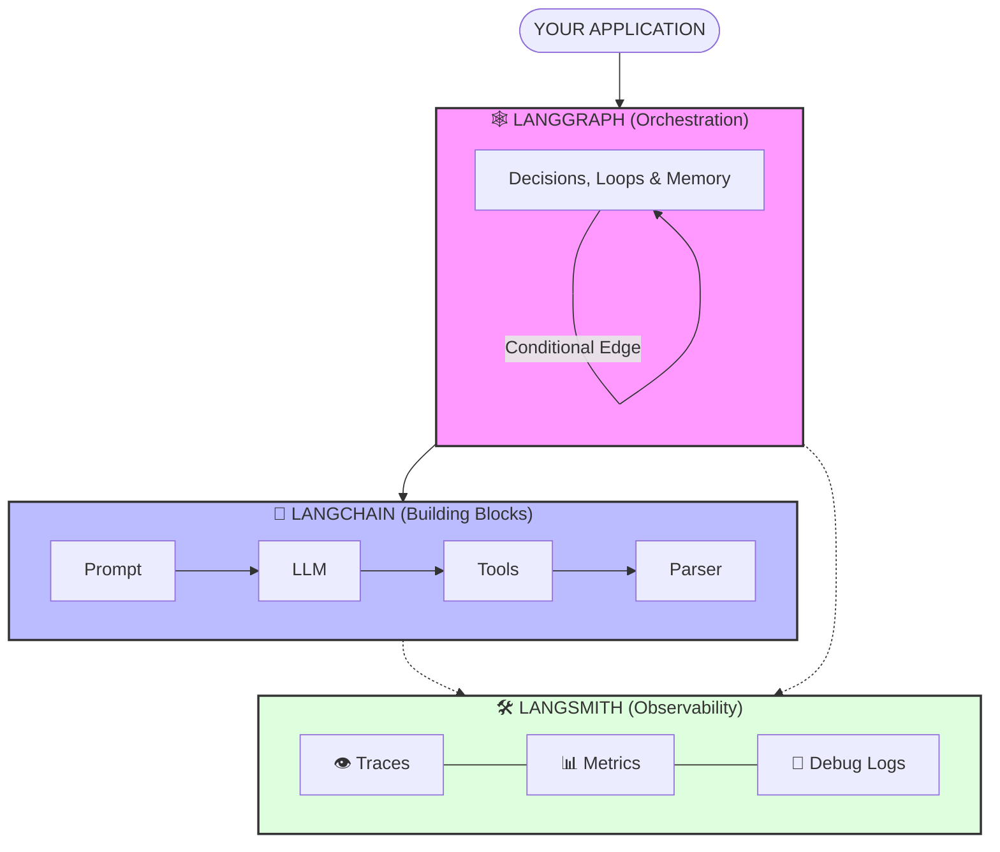
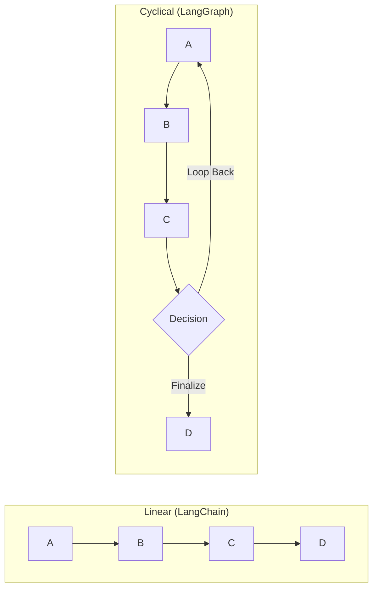
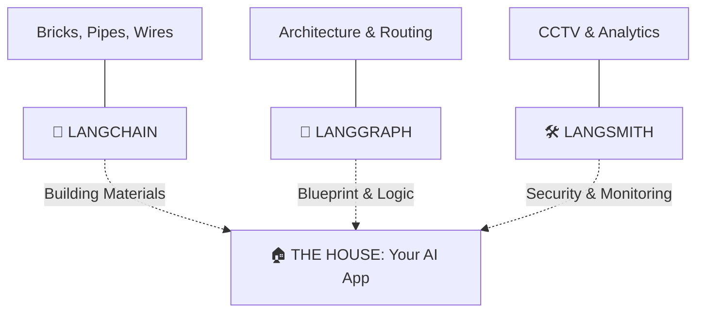

# 🧠 LLM Development Stack: LangChain, LangGraph & LangSmith

> **One line summary:** LangChain builds it → LangGraph thinks it through → LangSmith watches over it.

This stack turns raw AI models into **reliable, smart, and observable production applications**.

---

## 📚 Table of Contents

1. [Quick Overview](#quick-overview)
2. [LangChain - The Framework](#langchain---the-framework)
3. [LangGraph - The Orchestrator](#langgraph---the-orchestrator)
4. [LangSmith - The Platform](#langsmith---the-platform)
5. [One-Page Cheat Sheet](#one-page-cheat-sheet)
6. [Visual Diagrams](#visual-diagrams)
7. [Decision Tree](#decision-tree)
8. [Real-World Example](#real-world-example)
9. [Quick Install](#quick-install)
10. [Resources](#resources)

---

## 🎯 Quick Overview

| Tool | What It Does | Flow Type | Analogy |
| :--- | :--- | :--- | :--- |
| **LangChain** | Connects LLMs to data & tools | Linear (→) | Lego bricks |
| **LangGraph** | Adds loops & decision-making | Cyclical (↔) | Brain / logic |
| **LangSmith** | Debugs & monitors everything | Observability (👁️) | CCTV + black box |

---

## 🧱 LangChain - The Framework

### What It Is
LangChain is a framework that standardizes how you work with LLMs, prompts, memory, and tools.

### How It Works
`Input → Step A → Step B → Step C → Output`  
*(Always forward, never backward)*

### Real Example: Document Q&A Bot
1. User asks: "What is RAG?"
2. System searches your documents.
3. LLM generates answer from retrieved docs.
4. Returns answer to user.

### Best For
- Simple RAG pipelines
- Basic chatbots
- Data extraction from text
- Question answering over documents

### When NOT to Use
- Tasks that need self-correction
- Workflows that require loops
- Multi-step reasoning with backtracking

### Key Code (TypeScript)
```typescript
import { ChatOpenAI } from "@langchain/openai";
import { PromptTemplate } from "@langchain/core/prompts";
import { StringOutputParser } from "@langchain/core/output_parsers";

const model = new ChatOpenAI({ model: "gpt-4" });
const prompt = PromptTemplate.fromTemplate("Answer: {question}");
const parser = new StringOutputParser();

const chain = prompt.pipe(model).pipe(parser);
const result = await chain.invoke({ question: "What is AI?" });
```

---

## 🕸️ LangGraph - The Orchestrator

### What It Is
LangGraph adds state management and cycles (loops) to LangChain, allowing for branching and self-correction.

### How It Works
`Step 1 → Step 2 → (Need more info?) → Back to Step 1 → Step 3 → Done`

### Real Example: Research Assistant
1. Write draft answer to question.
2. Check if missing any key facts.
3. If missing → search again with refined query.
4. Go back to step 1 with new information.
5. Output final answer.

### Best For
- Multi-agent systems
- Autonomous coding assistants
- Self-correcting workflows
- Complex decision trees
- Tasks requiring validation loops

### Key Difference from LangChain
- **LangChain:** Linear, can't go back.
- **LangGraph:** Cyclical, can revisit any step.

### Key Code (TypeScript)
```typescript
import { StateGraph, END } from "@langchain/langgraph";

const graph = new StateGraph<AgentState>({
  channels: {
    question: { value: (a, b) => b ?? a },
    documents: { value: (a, b) => b ?? a },
    attempts: { value: (a, b) => (b ?? a) }
  }
});

graph.addNode("search", searchNode);
graph.addNode("generate", generateNode);
graph.addConditionalEdges("generate", shouldContinue);
graph.addEdge("search", "generate");
```

---

## 🛠️ LangSmith - The Platform

### What It Is
LangSmith is a debugging, testing, and monitoring platform for LLM applications.

### What It Shows You
- Every prompt and response
- Latency per step
- Where hallucinations happened
- Which prompt version worked best
- Cost per API call
- Token usage

### Real Example: Debugging a Wrong Answer
- **Without LangSmith:** "Why did the bot say that? 🤷‍♂️"
- **With LangSmith:** "Oh, step 2 searched the wrong document. Fixing now."

### Best For
- Debugging production issues
- A/B testing prompts
- Monitoring costs and latency
- Version control for prompts
- Identifying hallucinations

### Key Code (TypeScript)
```typescript
import { traceable } from "langsmith/traceable";

const answerQuestion = traceable(
  async (question: string) => {
    const docs = await retriever.getRelevantDocuments(question);
    return await llm.invoke(question, docs);
  },
  { name: "my_rag_pipeline" }
);
```

---

## 📋 One-Page Cheat Sheet

```text
┌─────────────────────────────────────────────────────────────────────────────┐
│                         THE GOLDEN RULE                                      │
│                                                                              │
│              LangChain = Build the path                                      │
│              LangGraph = Add the brain                                       │
│              LangSmith = Watch it work                                       │
└─────────────────────────────────────────────────────────────────────────────┘

┌─────────────────────┬─────────────────────┬─────────────────────────────────┐
│     LANGCHAIN       │     LANGGRAPH        │         LANGSMITH               │
│     (Bricks)        │     (Brain)          │         (Camera)                │
├─────────────────────┼─────────────────────┼─────────────────────────────────┤
│ Flow: Linear        │ Flow: Cyclical      │ Flow: Observability             │
│ A → B → C           │ A ↔ B ↔ C           │ Watches everything              │
├─────────────────────┼─────────────────────┼─────────────────────────────────┤
│ Use when:           │ Use when:           │ Use when:                       │
│ • Simple Q&A        │ • Research agents   │ • Debugging failures            │
│ • Basic chatbot     │ • Coding assistant  │ • Testing prompts               │
│ • Data extraction   │ • Self-correction   │ • Production monitoring         │
│ • RAG pipelines     │ • Multi-step reason │ • Cost tracking                 │
├─────────────────────┼─────────────────────┼─────────────────────────────────┤
│ Key code (TS):      │ Key code (TS):      │ Key code (TS):                  │
│ chain.pipe(model)   │ graph.addCond       │ traceable(                       │
│ .pipe(parser)       │ itionalEdges()      │ async () => {...}                │
└─────────────────────┴─────────────────────┴─────────────────────────────────┘

┌─────────────────────────────────────────────────────────────────────────────┐
│                         COMPARISON MATRIX                                    │
├─────────────────────────┬────────────┬────────────┬─────────────────────────┤
│ Feature                 │ LangChain  │ LangGraph  │ LangSmith               │
├─────────────────────────┼────────────┼────────────┼─────────────────────────┤
│ Linear flows            │ ✅         │ ✅         │ 👁️ (observes)           │
│ Cycles/loops            │ ❌         │ ✅         │ 👁️ (observes)           │
│ Memory/state            │ Limited    │ ✅         │ 👁️ (observes)           │
│ Debugging tools         │ ❌         │ ❌         │ ✅                       │
│ Prompt versioning       │ ❌         │ ❌         │ ✅                       │
│ Cost tracking           │ ❌         │ ❌         │ ✅                       │
│ Latency monitoring      │ ❌         │ ❌         │ ✅                       │
└─────────────────────────┴────────────┴────────────┴─────────────────────────┘

💡 MEMORY TRICK:
   Chain  = Connects in a line
   Graph  = Goes in circles (loops)
   Smith  = Sees everything
   
   C → G → S  =  Build → Think → Watch
```

---

## 🎨 Visual Diagrams

### Diagram 1: How They Layer Together
The stack operates as a collaborative ecosystem where each layer has a distinct responsibility.



### Diagram 2: Flow Type Comparison
Visualizing the fundamental architectural difference between standard chains and stateful graphs.



### Diagram 3: The "House" Analogy
Understanding the dependency and role of each tool through simple construction concepts.



---


## 🔄 Decision Tree

### Quick Decision Flow
```text
Start: Do you need loops or self-correction?
                    │
        ┌───────────┴───────────┐
        │                       │
        No                      Yes
        │                       │
        ▼                       ▼
   ┌─────────┐            ┌──────────┐
   │LangChain│            │LangGraph │
   │  only   │            │ + LangChain
   └─────────┘            └──────────┘
        │                       │
        └───────────┬───────────┘
                    ▼
        Do you need debugging or monitoring?
                    │
        ┌───────────┴───────────┐
        │                       │
        Yes                     No
        │                       │
        ▼                       ▼
   ┌──────────┐            ┌──────────┐
   │LangSmith │            │   Skip   │
   │  (add)   │            │ LangSmith│
   └──────────┘            └──────────┘
```

### When to Add Each Tool
| Scenario | Action |
| :--- | :--- |
| "My prototype works but is messy" | → Add **LangSmith** |
| "I need my app to try again if it fails" | → Add **LangGraph** |
| "I'm building from scratch" | → Start with **LangChain** |
| "I have >3 steps in my chain" | → Consider **LangGraph** |
| "My app is in production" | → Must have **LangSmith** |

---

## 💡 Real-World Example: Research Assistant

### Step 1 - Start Simple (LangChain only)
```typescript
// Basic Q&A over documents
const chain = retriever.pipe(model).pipe(parser);
const answer = await chain.invoke("What is quantum computing?");
```

### Step 2 - Add Self-Correction (Add LangGraph)
```typescript
// Now it can loop back if answer is incomplete
const graph = new StateGraph<State>();
graph.addNode("search", searchDocs);
graph.addNode("check", verifyQuality);
graph.addConditionalEdges("check", shouldContinue);
// If check fails → goes back to search
```

### Step 3 - Add Monitoring (Add LangSmith)
```typescript
const research = traceable(
  async (question: string) => {
    return await graph.invoke({ question });
  },
  { name: "research_assistant" }
);
```

### What Happens Under the Hood
User asks: *"Explain quantum computing in simple terms"*

1.  **🕸️ LangGraph:** Start research process.
2.  **🧱 LangChain:** Search for "quantum computing basics" → finds 5 docs.
3.  **🧱 LangChain:** Generate draft answer.
4.  **🕸️ LangGraph:** Check quality → Missing "superposition" explanation.
5.  **🕸️ LangGraph:** Loop back with refined search "superposition simple explanation".
6.  **🧱 LangChain:** Search again → finds 2 more docs.
7.  **🧱 LangChain:** Regenerate complete answer.
8.  **✅ Output final answer.**

**👁️ LangSmith records everything:**
-   **Step 2:** 0.8 seconds, 5 documents found
-   **Step 3:** 2.1 seconds, GPT-4, cost $0.03
-   **Step 4:** Quality score 65% (threshold 80%)
-   **Step 5:** Loop triggered (1 iteration)
-   **Step 6:** 0.4 seconds, 2 documents found
-   **Total:** 3.7 seconds, $0.045, 847 tokens

---

## ⚡ Quick Install
```bash
npm install langchain @langchain/langgraph langsmith
```

---

## 🔗 Resources
- [Official Website](https://langchain.com)
- [LangChain.js Documentation](https://js.langchain.com)
- [LangGraph.js Reference](https://langchain-ai.github.io/langgraphjs/)
- [LangSmith Platform](https://smith.langchain.com)

---
*Created for the Modern AI Engineer.*