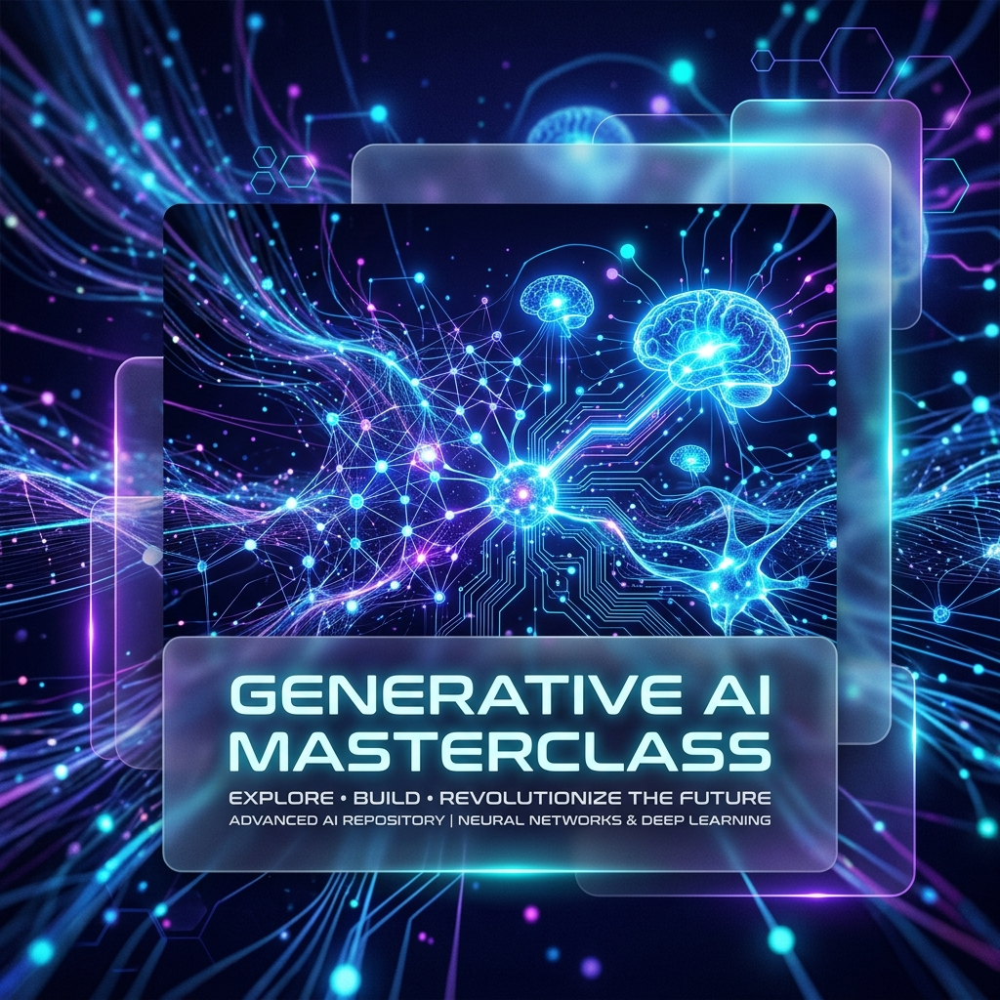

# 🧠 Generative AI Masterclass: From Fundamentals to Agentic Autonomy ✨

Welcome to the ultimate repository for mastering **Generative AI**. This project is a curated, technical roadmap designed to take you from understanding simple tokenization to building complex, autonomous agentic systems. 🚀

---

## 🌟 Why This Repository?

In a world rapidly evolving with AI, staying ahead means understanding the "Why" and the "How". This repo doesn't just show you how to call an API; it dives into the architecture, the math, and the orchestration that makes AI feel like magic. 🪄

### 💎 Key Specialties & Features

| Specialty | Description | Emojis |
|-----------|-------------|--------|
| **Core Mechanics** | Deep dive into Tokens, Context Windows, and Inference. | ⚙️ 🔢 |
| **RAG Systems** | Building Retrieval-Augmented Generation with Vector Databases. | 📚 🔍 |
| **Agentic AI** | Autonomous agents that use tools and maintain long-term memory. | 🤖 🛠️ |
| **Advanced Orchestration** | Mastering LangGraph, LangChain, and LangSmith for production. | 🕸️ 🧪 |
| **MCP Integration** | Leveraging Model Context Protocol for seamless tool communication. | 🔌 📡 |
| **Hardware Agnostic** | Implementations for both large-scale GPUs and Small Language Models (SLMs). | 💻 📱 |
| **Memory Management** | Techniques for efficient memory usage in AI pipelines and models. | 🧠💾 |

---

## 🗺️ Roadmap & Directory Structure

The learning path is divided into two main pillars:

### 1. 📂 [Basic-UseCase](./1.%20Basic-UseCase) - The Foundation 🧱
This directory focuses on the essential building blocks required to start building with Generative AI. It covers:
*   **Fundamental Mechanics**: A deep dive into how LLMs function, covering tokenization, context windows, and the inference process.
*   **Prompt Engineering**: Practical guides on Zero-shot, Few-shot, Chain of Thought, and ReAct prompting techniques.
*   **Company Chatbots**: A step-by-step implementation of a Retrieval-Augmented Generation (RAG) system for custom business data.
*   **Invoking LLMs**: Learn how to interact with various model providers (OpenAI, Anthropic, etc.) using standardized APIs.
*   **Vector Database Mastery**: Evaluation and setup guides for Pinecone, PGVector, and ChromaDB.

### 2. 📂 [Advance-GenAI](./2.%20Advance-GenAI) - The Frontier 🌌
This directory explores cutting-edge implementations and complex orchestration patterns for production-grade AI systems.
*   **AI-TodoApp**: An end-to-end application demonstrating agentic state management and persistent memory.
*   **WebPage-SupportPage**: Automated customer support systems with real-time web integration.
*   **LangGraph & Orchestration**: Advanced multi-agent systems using LangGraph, LangChain, and performance tracking with LangSmith.
*   **LLM-Clash**: A comparative framework to benchmark different models (GPT-4 vs Llama 3 vs DeepSeek) on logic and coding tasks.
*   **MCP (Model Context Protocol)**: Implementing the future of standardized AI-tool communication and server-side logic.
*   **Deep Dive: How LLMs Work**: Theoretical and technical breakdowns of Transformer blocks, Attention mechanisms, and Training pipelines.
*   **AI-Chat-PDF-RAG**: A full-stack application for chatting with PDF documents using Retrieval-Augmented Generation (RAG). Features a modern glassmorphism UI, secure Clerk authentication, Neon PostgreSQL database, and Groq AI integration.
*   **Own-AI-IDE**: An AI-powered code generation agent that takes a plain English prompt and **automatically scaffolds a complete working project** — creating every folder and file on disk. Powered by **Llama 3.3 70B** via Groq with enforced JSON-only output and support for multiple LLM providers.
*   **Memory Management**: Techniques for efficient memory usage in AI pipelines and models, ensuring optimal performance and resource utilization.
*   **OpenAI Agent SDK**: An AI-powered agent built with the **OpenAI Agent SDK** that runs locally via **Ollama**. Features real-time **tool/function calling** (e.g., weather lookups), Zod schema validation, and seamless switching between local LLMs and OpenAI cloud models.

---

## 📣 Stay Tuned!

The world of Generative AI is moving at lightning speed. This repository is frequently updated with the latest research, new model implementations, and advanced agentic patterns. 

**Don't just watch the AI revolution—build it.** 🛠️✨

---
*Created with ❤️ by Sanidhya Gupta. Stay curious.*
